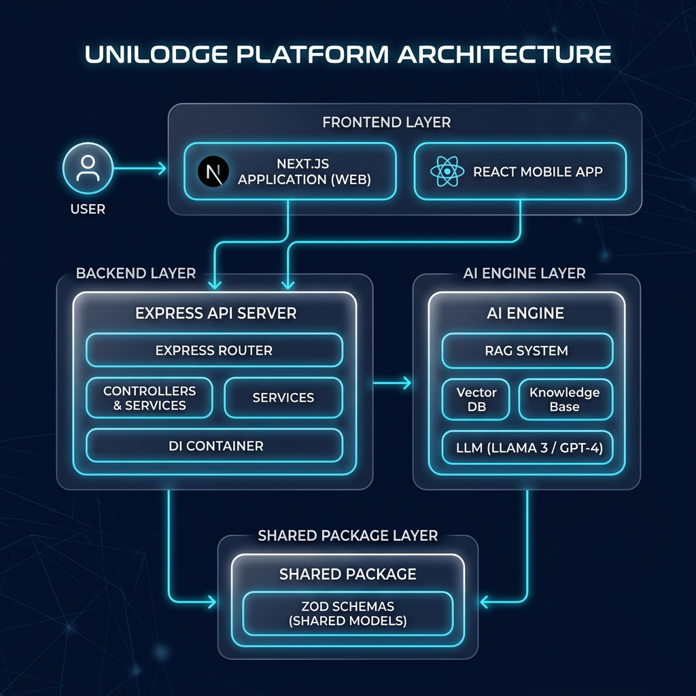
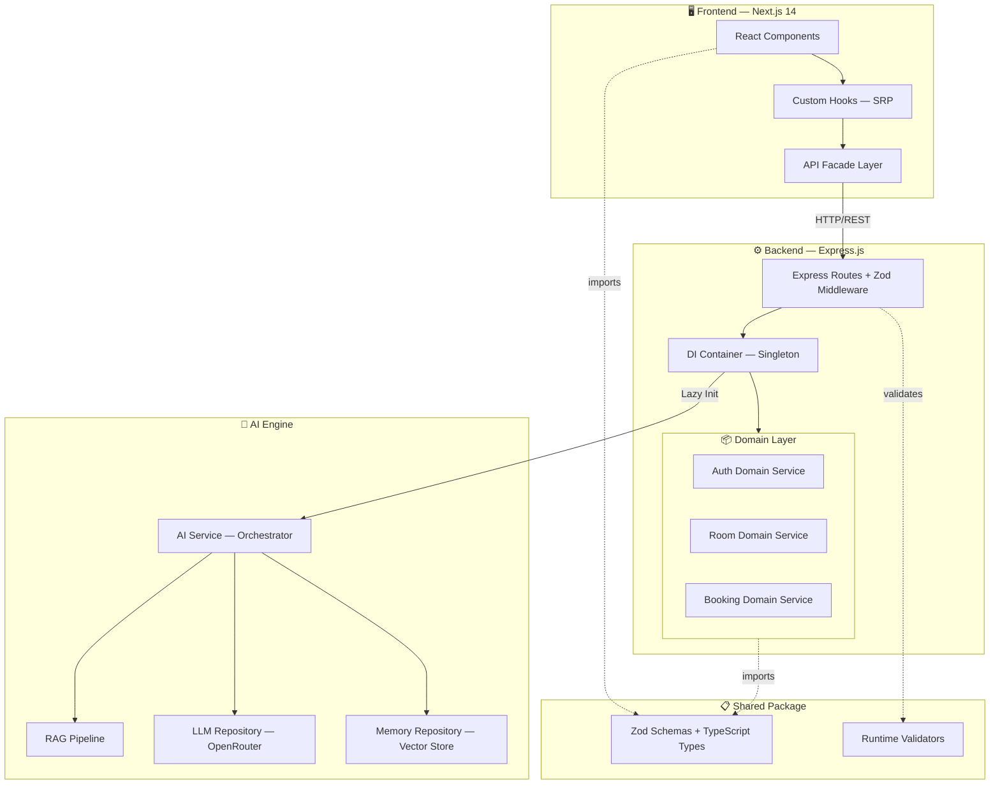
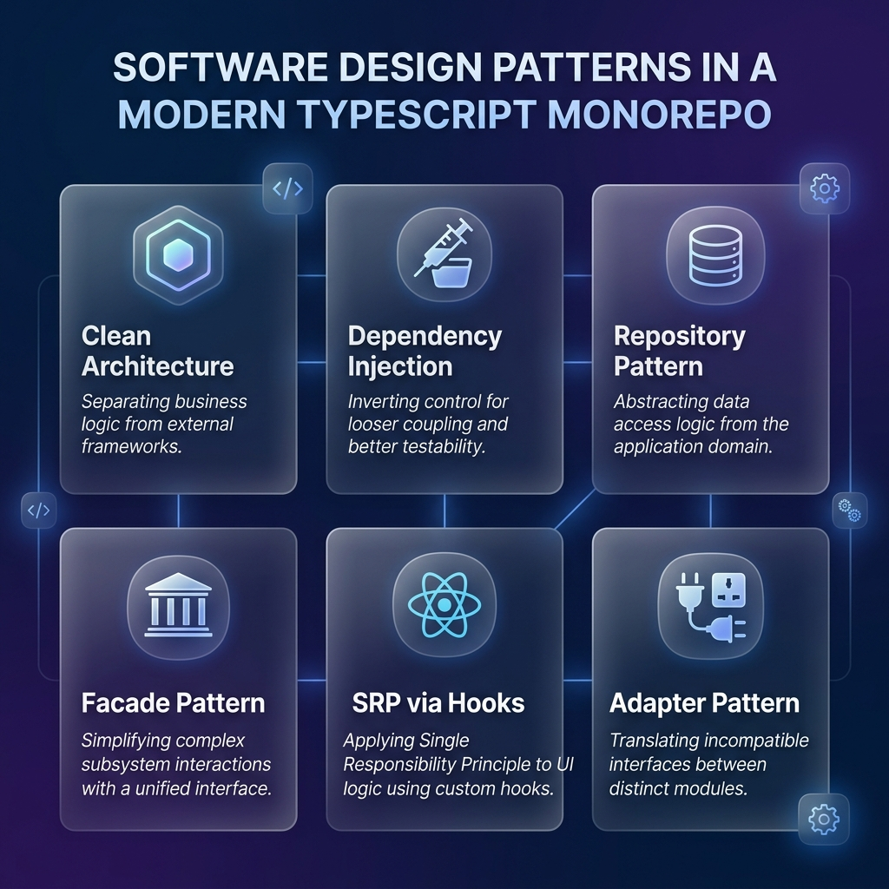

<p align="center">
  
</p>

<h1 align="center">UniLodge v2</h1>

<p align="center">
  <strong>AI-Powered Campus Accommodation Management System</strong><br/>
  Built with Clean Architecture · TypeScript Monorepo · Zod-Validated APIs · RAG-Enabled AI Engine
</p>

<p align="center">
  
  
  
  
  
  
</p>

---

## 📖 Table of Contents

- [Overview](#overview)
- [System Architecture](#system-architecture)
- [Design Patterns](#design-patterns)
- [Monorepo Structure](#monorepo-structure)
- [Tech Stack](#tech-stack)
- [Getting Started](#getting-started)
- [Testing](#testing)
- [API Reference](#api-reference)
- [Contributing](#contributing)

---

## Overview

UniLodge is a full-stack, production-grade campus accommodation platform that connects visiting interns, guest lecturers, and students with verified university housing. The platform features:

- **AI-Powered Room Matching** — RAG-based recommendation engine with contextual chat
- **Dynamic Price Optimization** — ML-driven pricing suggestions with market analysis
- **Role-Based Dashboards** — Tailored experiences for Guests, Wardens, and Administrators
- **Digital Mess Cards** — QR-code based meal access system
- **Real-Time Booking Management** — Complete check-in/check-out workflow with payment processing

---

## System Architecture

<p align="center">
  
</p>

The platform follows a **layered monorepo architecture** with strict dependency boundaries:



### Data Flow

1. **User Action** → React component triggers a custom hook
2. **Hook** → Calls the API Facade (single HTTP client)
3. **API Facade** → Sends validated request to Express route
4. **Route Middleware** → Zod validates the request body
5. **DI Container** → Resolves the appropriate domain service
6. **Domain Service** → Executes business logic, returns result
7. **Response** → Flows back through the same chain

---

## Design Patterns

<p align="center">
  
</p>

### Patterns in Detail

| Pattern | Location | Purpose |
|---------|----------|---------|
| **Clean Architecture** | `apps/backend/src/domains/` | Isolates business logic from frameworks; domain services have zero knowledge of Express |
| **Dependency Injection** | `apps/backend/src/container.ts` | Singleton DI container resolves all services; enables testing with mock implementations |
| **Repository Pattern** | `apps/backend/src/domains/ai/repositories.ts` | Abstracts data access behind interfaces; swap Postgres for MongoDB without touching business logic |
| **Façade Pattern** | `apps/frontend/lib/services/api.ts` | Single entry point for all HTTP calls; components never construct URLs or handle tokens directly |
| **SRP via Hooks** | `apps/frontend/hooks/` | Each hook owns exactly one concern: `useAuth`, `useRooms`, `useBookings` |
| **Adapter Pattern** | AI Engine LLM integration | Translates OpenRouter API responses into domain-specific types |
| **Zod Validation** | `packages/shared/src/types.ts` | Runtime schema validation at API boundaries; types inferred from schemas for zero-drift |

---

## Monorepo Structure

```
unilodge-new/
├── apps/
│   ├── frontend/                  # Next.js 14 Application
│   │   ├── app/                   # App Router (page.tsx entry point)
│   │   ├── components/            # Reusable UI components
│   │   │   ├── common/            # Badge, Footer, Icons, Layout, Modal
│   │   │   ├── ui/                # Skeleton loaders, Toast, GlowingCard
│   │   │   ├── chat/              # ChatWidget
│   │   │   └── payment/           # PaymentModal
│   │   ├── hooks/                 # Custom React hooks (SRP)
│   │   │   ├── useAuth.ts         # Authentication state
│   │   │   ├── useRooms.ts        # Room data management
│   │   │   └── useBookings.ts     # Booking CRUD operations
│   │   ├── lib/
│   │   │   ├── pages/             # Page-level components
│   │   │   │   ├── HomePage.tsx
│   │   │   │   ├── LoginPage.tsx
│   │   │   │   ├── GuestDashboard.tsx
│   │   │   │   ├── WardenDashboard.tsx
│   │   │   │   ├── AdminDashboard.tsx
│   │   │   │   └── AiAgentChat.tsx
│   │   │   └── services/          # API facade + AI services
│   │   └── cypress/               # E2E test specs
│   │
│   └── backend/                   # Express.js API Server
│       ├── src/
│       │   ├── domains/           # Clean Architecture domain layer
│       │   │   ├── auth/          # Authentication domain
│       │   │   ├── property/      # Room/property domain
│       │   │   ├── user/          # User management domain
│       │   │   └── ai/            # AI engine domain
│       │   │       ├── services/  # AIService orchestrator
│       │   │       ├── repositories.ts  # Repository interfaces
│       │   │       └── types.ts   # AI-specific branded types
│       │   ├── routes/            # Express route handlers
│       │   ├── middleware/        # Zod validation, rate limiting, logging
│       │   ├── services/          # Service barrel exports
│       │   └── container.ts       # DI container (singleton)
│       └── __tests__/             # Jest unit tests
│
├── packages/
│   └── shared/                    # Shared types & validators
│       └── src/types.ts           # Zod schemas → TypeScript types
│
├── docs/images/                   # Architecture diagrams
├── tsconfig.base.json             # Shared TypeScript configuration
├── package.json                   # Root monorepo config
└── report.md                      # System design analysis
```

---

## Tech Stack

### Frontend
| Technology | Purpose |
|-----------|---------|
| **Next.js 14** | React framework with App Router |
| **TypeScript 5** | Type-safe development |
| **Framer Motion** | Animations and transitions |
| **Lucide React** | Icon library |
| **Zod** | Client-side form validation |

### Backend
| Technology | Purpose |
|-----------|---------|
| **Express.js 4** | HTTP server framework |
| **TypeScript 5** | Strict mode compilation |
| **Zod** | Request body validation middleware |
| **Custom DI Container** | Dependency injection |

### AI Engine
| Technology | Purpose |
|-----------|---------|
| **OpenRouter API** | LLM gateway (multi-model) |
| **RAG Pipeline** | Retrieval-Augmented Generation |
| **Vector Embeddings** | Semantic search for room matching |

### Testing & Quality
| Technology | Purpose |
|-----------|---------|
| **Jest + ts-jest** | Backend unit testing |
| **Cypress** | Frontend E2E testing |
| **TypeScript Strict Mode** | Zero compiler errors enforced |
| **ESLint** | Code quality linting |

---

## Getting Started

### Prerequisites

- **Node.js** ≥ 18.0
- **npm** ≥ 9.0

### Installation

```bash
# Clone the repository
git clone https://github.com/your-org/unilodge-v2.git
cd unilodge-v2

# Install all workspace dependencies
npm install
```

### Environment Setup

Create `.env` files in each application workspace:

**`apps/backend/.env`**
```env
PORT=5000
NODE_ENV=development
JWT_SECRET=your-jwt-secret
```

**`apps/frontend/.env.local`**
```env
NEXT_PUBLIC_API_URL=http://localhost:5000/api
NEXT_PUBLIC_OPENROUTER_API_KEY=your-openrouter-key
```

### Running the Platform

```bash
# Start the backend server
cd apps/backend && npm run dev

# Start the frontend (separate terminal)
cd apps/frontend && npm run dev
```

The frontend runs at `http://localhost:3000` and the backend API at `http://localhost:5000`.

---

## Testing

### Backend Unit Tests (Jest)

```bash
cd apps/backend
npm test
```

**Current Coverage:**
- `AuthService` — authentication, registration, token validation
- All domain services compile with zero errors

### Frontend E2E Tests (Cypress)

```bash
cd apps/frontend
npx cypress open
```

**Test Suites:**
- Homepage load and navigation
- Login modal interaction

---

## API Reference

### Authentication

| Method | Endpoint | Description |
|--------|----------|-------------|
| `POST` | `/api/auth/login` | Authenticate user |
| `POST` | `/api/auth/register` | Register new user |
| `GET` | `/api/auth/me` | Get current user (requires Bearer token) |

### Rooms

| Method | Endpoint | Description |
|--------|----------|-------------|
| `GET` | `/api/rooms` | List all rooms (with filters) |
| `GET` | `/api/rooms/:id` | Get room by ID |

### AI Engine

| Method | Endpoint | Description |
|--------|----------|-------------|
| `GET` | `/api/ai/health` | AI service health check |
| `POST` | `/api/ai/chat` | Send chat message (RAG-enabled) |
| `POST` | `/api/ai/price-suggestion` | Get AI price suggestion |
| `POST` | `/api/ai/recommendations` | Get room recommendations |
| `POST` | `/api/ai/analyze` | Analyze accommodation description |

All POST endpoints are validated with **Zod schemas** at the middleware layer.

---

## Contributing

1. Fork the repository
2. Create a feature branch: `git checkout -b feature/my-feature`
3. Ensure zero TypeScript errors: `npx tsc --noEmit`
4. Run tests: `npm test`
5. Submit a Pull Request

---

<p align="center">
  <sub>Built with ❤️ for campus communities worldwide</sub>
</p>
