# System Design - UniLodge Platform

## Overview

UniLodge is a modern, scalable platform for managing student accommodation. The system enables students to discover and book lodging, property wardens to manage listings and bookings, and administrators to oversee the platform.

The architecture follows a **three-tier model** with a decoupled AI engine:
- **Frontend**: Next.js web application (Student, Warden, Admin portals)
- **Backend API**: Express.js REST API (core business logic)
- **AI Engine**: Separate service for LLM-powered features
- **Database**: MongoDB for documents + PostgreSQL for structured data

---

## Architecture Layers

### 1. **Presentation Layer** (Frontend)

**Technology**: Next.js 14, TypeScript, React

**Responsibilities**:
- User authentication UI (login, registration, email verification)
- Student portal: room search, booking, reviews, chat
- Warden portal: room management, booking approvals, check-ins
- Admin dashboard: platform moderation, analytics

**Communication**: RESTful API calls with JWT authentication

---

### 2. **Application Layer** (Backend API)

**Technology**: Express.js, Node.js, TypeScript

**Core Services**:
- **AuthService**: JWT token management, email verification, password hashing
- **RoomService**: Room CRUD, search, availability checks, pricing
- **BookingService**: Booking lifecycle, payment processing, status updates
- **ReviewService**: Room reviews and ratings
- **NotificationService**: In-app notifications, emails
- **ChatService**: Real-time messaging with AI assistance

**Key Features**:
- Role-based access control (RBAC)
- Input validation & sanitization
- Error handling & logging
- Middleware for authentication & authorization

---

### 3. **Data Layer**

**Primary Database**: MongoDB
- Document storage for flexible schemas
- Collections: Users, Rooms, Bookings, Reviews, Notifications, Chat Messages

**Secondary Database**: PostgreSQL
- Structured analytics queries
- Transactional integrity for critical operations

**Connection Management**: Database pools for efficient resource usage

---

### 4. **AI Engine Service**

**Technology**: Express.js microservice

**Capabilities**:
- Room recommendations based on user preferences
- Dynamic price suggestions using ML models
- AI-powered chat support for students
- Natural language processing for room descriptions

**Integration**: OpenRouter API for hosted LLM inference

**Design**: Stateless microservice — each request is self-contained

---

## Domain Model

### Core Entities

#### User
```
- id: UUID
- email: string (unique)
- password: hashed
- name: string
- role: "STUDENT" | "WARDEN" | "ADMIN"
- verified: boolean
- createdAt: timestamp
```

#### Room
```
- id: UUID
- wardenId: UUID (foreign key)
- title: string
- description: string
- capacity: number
- basePrice: decimal
- status: "AVAILABLE" | "OCCUPIED" | "MAINTENANCE"
- amenities: string[]
- createdAt: timestamp
```

#### Booking
```
- id: UUID
- guestId: UUID (foreign key)
- roomId: UUID (foreign key)
- checkInDate: date
- checkOutDate: date
- status: "PENDING" | "APPROVED" | "REJECTED" | "CANCELLED" | "CHECKED_IN"
- totalPrice: decimal
```

#### Payment
```
- id: UUID
- bookingId: UUID (foreign key)
- amount: decimal
- status: "PENDING" | "COMPLETED" | "FAILED" | "REFUNDED"
- transactionId: string (Stripe)
```

#### Review
```
- id: UUID
- roomId: UUID (foreign key)
- authorId: UUID (foreign key)
- rating: 1-5
- content: string
```

---

## Data Flow Diagrams

### Core Domain Entities

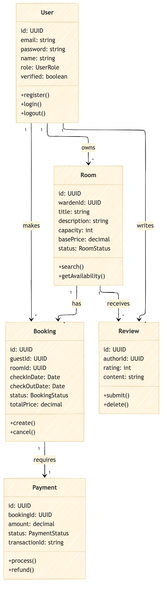

---

### Service Architecture

#### Auth Service Layer
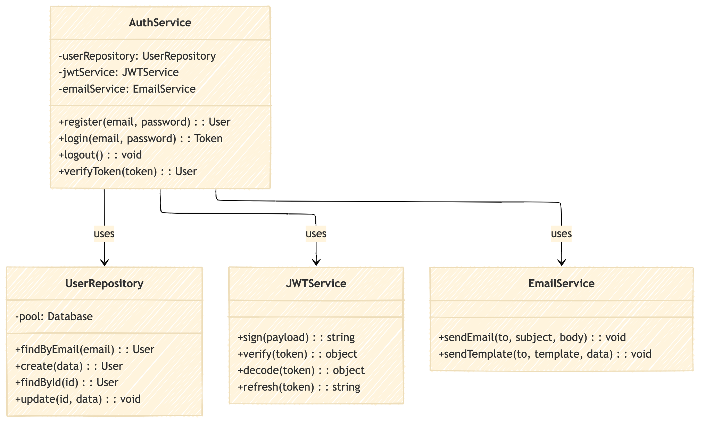

#### Room Service Layer
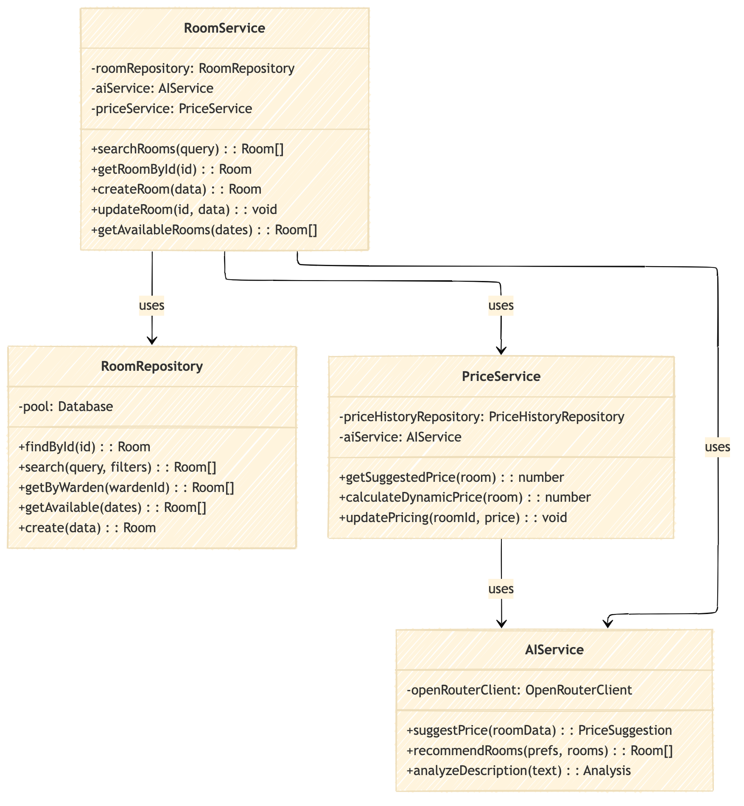

#### Booking Service Layer
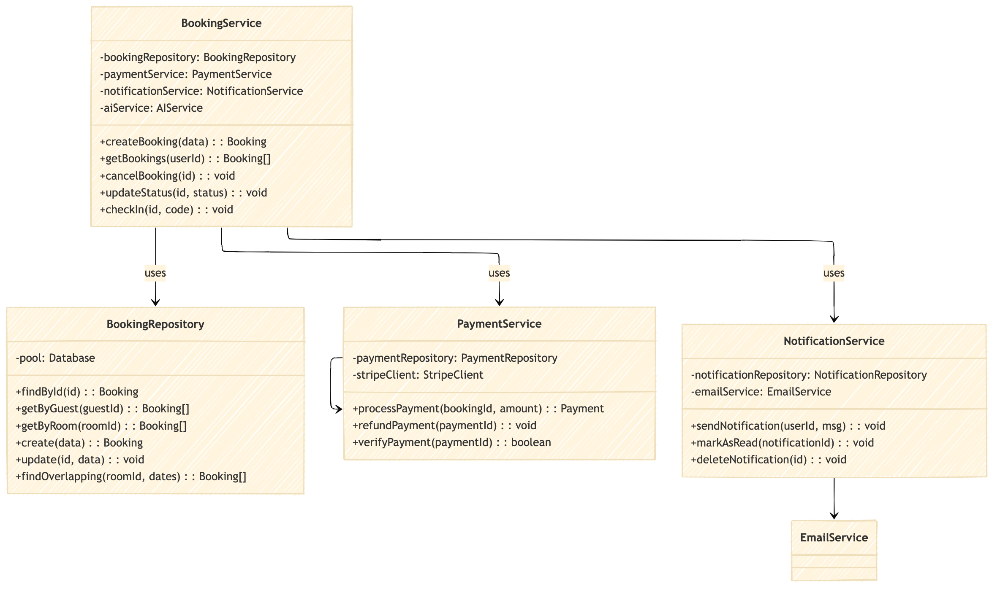

#### Notification & Chat Services
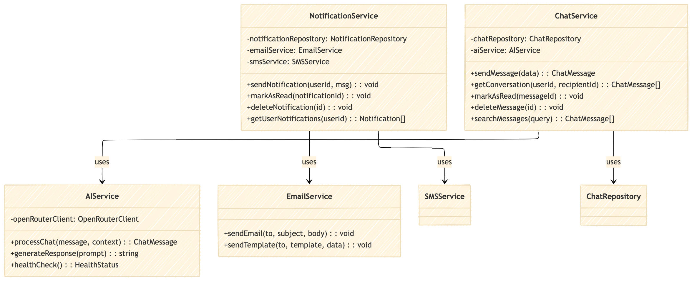

---

### Database Schema

#### Core Identity Schema
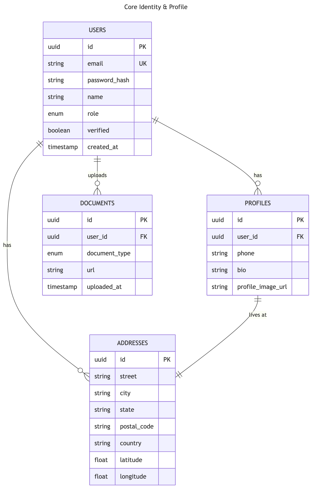

#### Rooms Schema
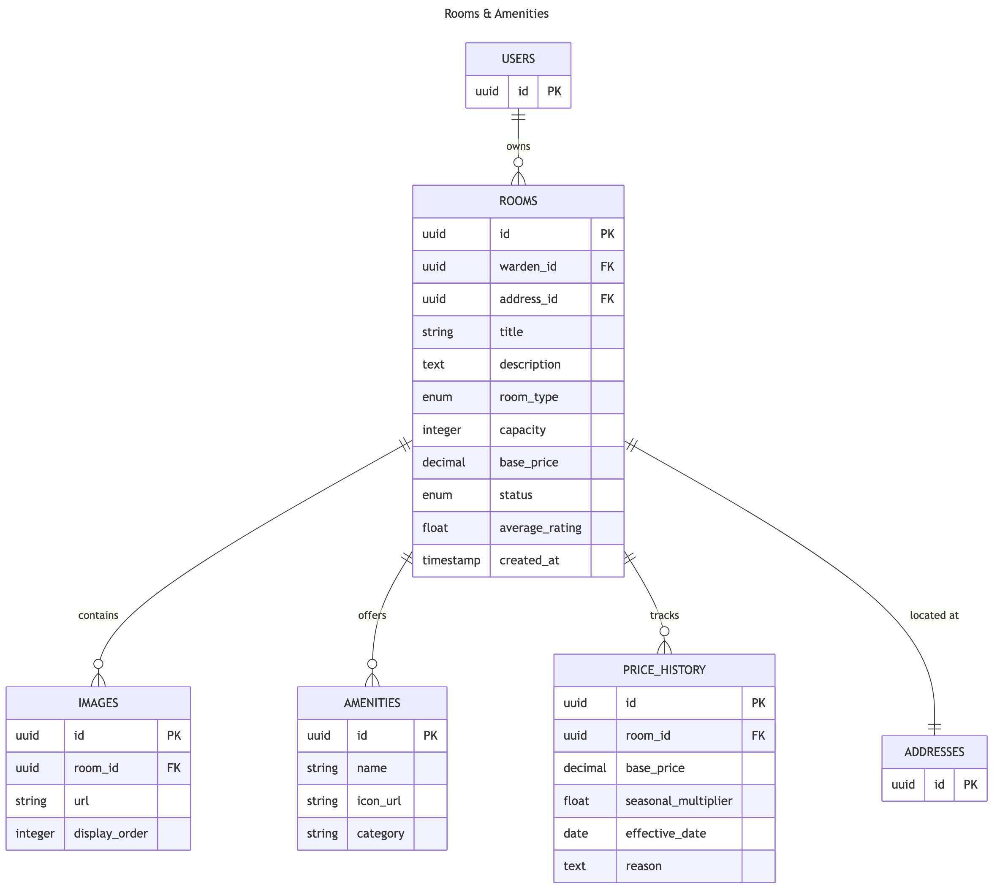

#### Bookings Schema
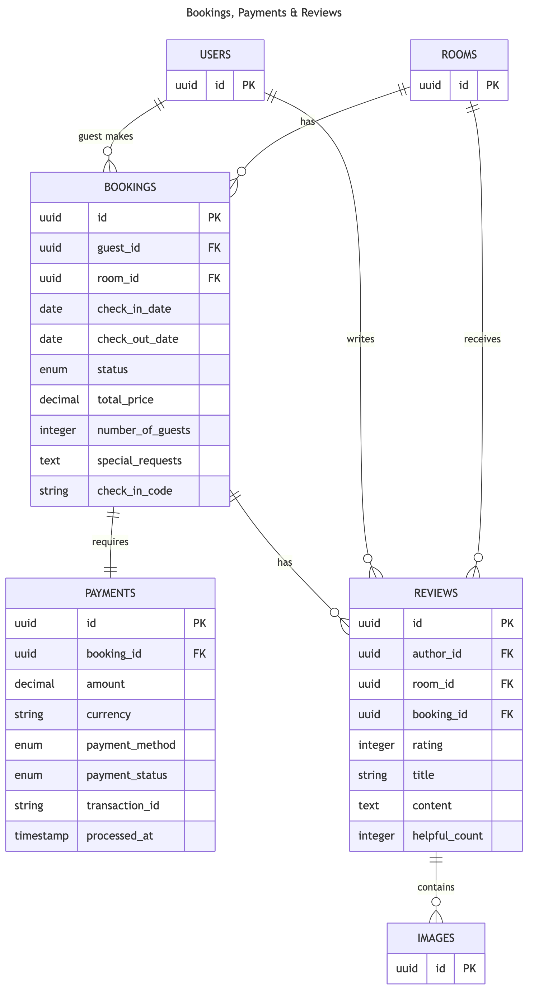

#### Messaging Schema
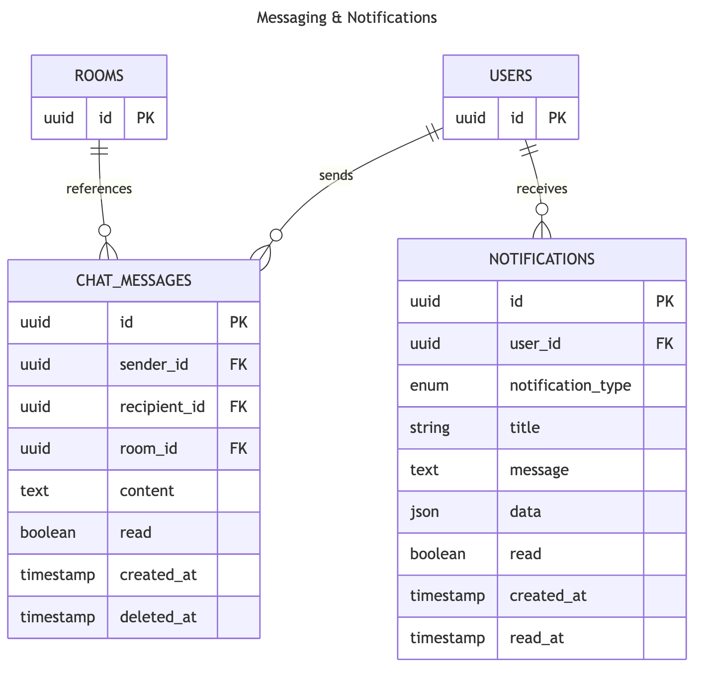

---

### Sequence Flows

#### 1. User Registration
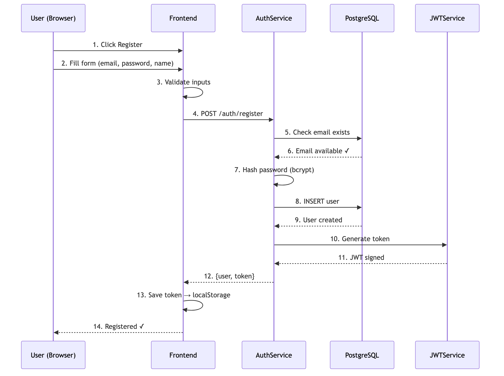

**Steps**:
1. User submits email & password via frontend
2. Backend validates input & hashes password
3. User record created in MongoDB
4. Verification email sent via EmailService
5. JWT token returned to client

---

#### 2. User Login
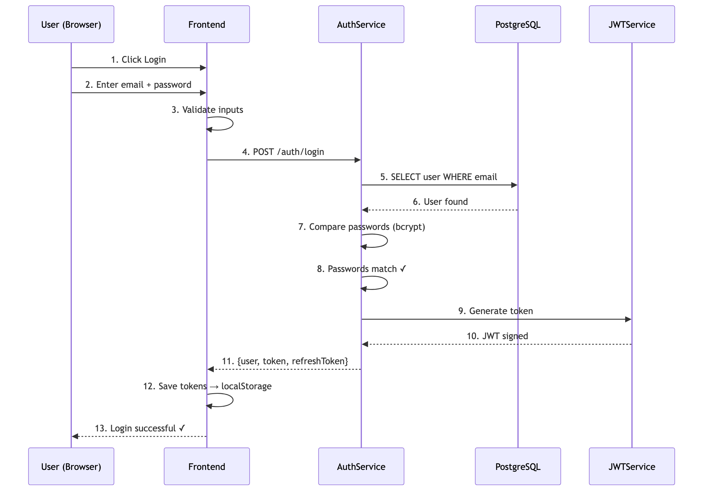

**Steps**:
1. User submits credentials
2. Backend verifies against stored password hash
3. JWTService generates access & refresh tokens
4. Tokens returned to client
5. Client stores tokens (localStorage/secure cookie)

---

#### 3. Room Search & Discovery
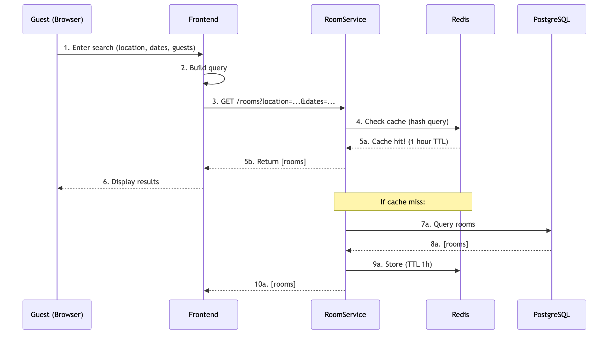

**Steps**:
1. Student enters search criteria (location, dates, price)
2. RoomService queries MongoDB with filters
3. AIService recommends rooms based on preferences
4. Availability checked against existing bookings
5. Results returned with pricing & ratings

---

#### 4. Booking Creation
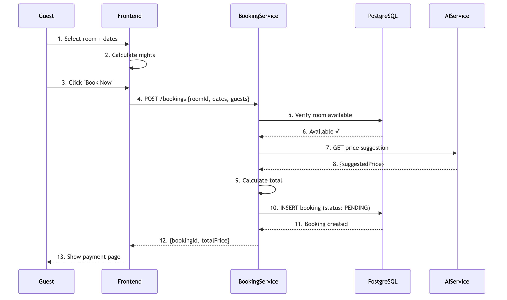

**Steps**:
1. Student selects room & confirms booking
2. BookingService validates dates & room availability
3. PriceService calculates final price
4. Booking record created with "PENDING" status
5. Notification sent to warden
6. Confirmation email sent to student

---

#### 5. Payment Processing
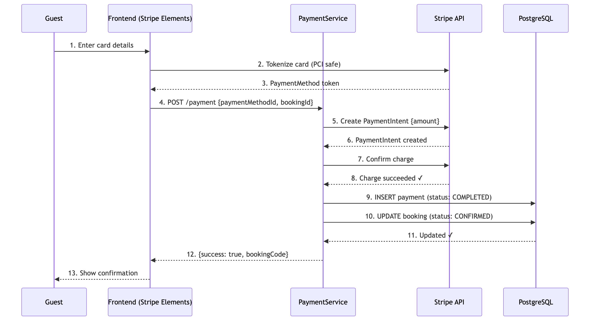

**Steps**:
1. PaymentService receives payment details
2. Stripe processes card payment
3. Transaction ID stored in Payment record
4. Booking status updated to "APPROVED"
5. Check-in code generated & sent to student
6. Notification sent to warden

---

#### 6. AI-Powered Chat
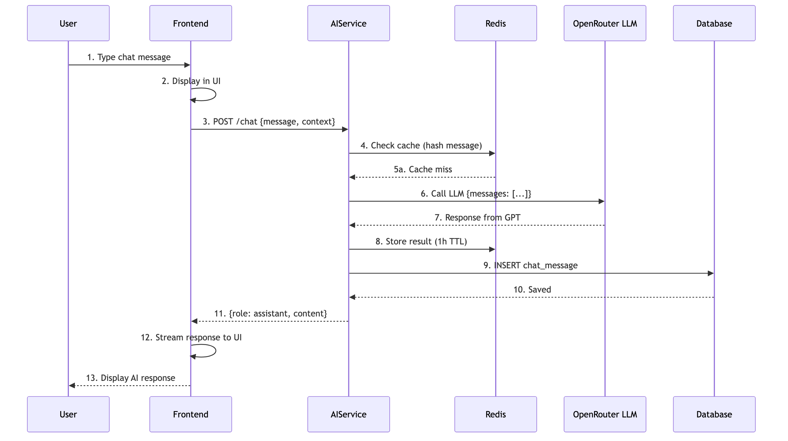

**Steps**:
1. Student sends message via ChatService
2. Message stored in MongoDB
3. AI Engine processes message through LLM
4. AI-generated response created
5. Response stored in chat history
6. Real-time notification to user

---

#### 7. Room Approval Workflow
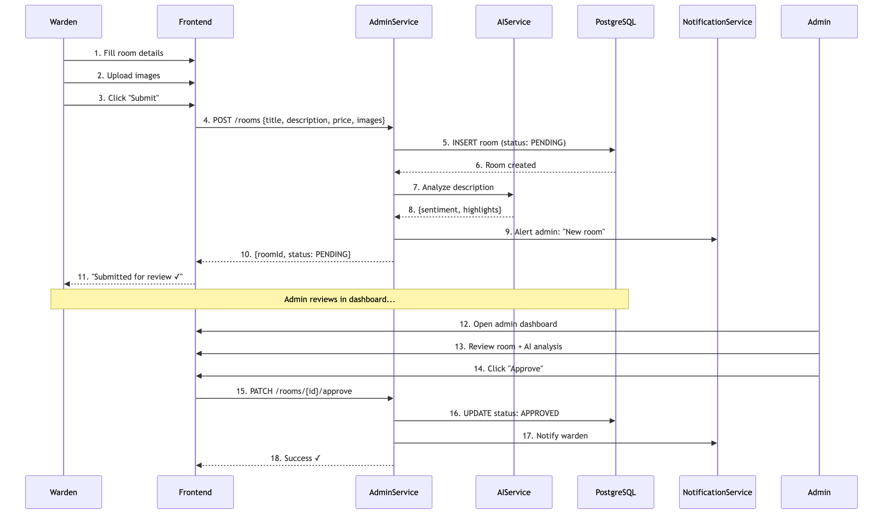

**Steps**:
1. Warden submits new room listing
2. Room stored with "PENDING_APPROVAL" status
3. Admin reviews room details & photos
4. AIService analyzes room description & pricing
5. Admin approves/rejects room
6. Notification sent to warden

---

## API Structure

### Authentication Endpoints
- `POST /auth/register` - User registration
- `POST /auth/login` - User login
- `POST /auth/refresh` - Refresh JWT token
- `POST /auth/logout` - Logout
- `GET /auth/verify` - Verify token validity

### Room Management
- `GET /rooms` - Search rooms (with filters)
- `GET /rooms/:id` - Get room details
- `POST /rooms` - Create new room (Warden)
- `PUT /rooms/:id` - Update room (Warden)
- `DELETE /rooms/:id` - Delete room (Warden/Admin)

### Booking Management
- `POST /bookings` - Create booking
- `GET /bookings` - List user bookings
- `GET /bookings/:id` - Get booking details
- `PUT /bookings/:id/approve` - Approve booking (Warden)
- `PUT /bookings/:id/reject` - Reject booking (Warden)
- `PUT /bookings/:id/cancel` - Cancel booking
- `POST /bookings/:id/checkin` - Check-in (Warden)

### Payment
- `POST /payments` - Process payment
- `GET /payments/:id` - Get payment status
- `POST /payments/:id/refund` - Refund payment

### Reviews
- `POST /reviews` - Submit review
- `GET /reviews/room/:roomId` - Get room reviews
- `DELETE /reviews/:id` - Delete review

### Chat & Notifications
- `POST /chat/messages` - Send message
- `GET /chat/conversations/:userId` - Get chat history
- `GET /notifications` - Get notifications
- `PUT /notifications/:id/read` - Mark as read

### AI Engine
- `POST /ai/recommend-rooms` - Get room recommendations
- `POST /ai/suggest-price` - Get price suggestions
- `POST /ai/chat` - AI-powered chat

---

## Deployment Architecture

```
GitHub Repository
    ├── Frontend (Next.js)
    │   └── Vercel (CDN-distributed, auto-deployment)
    │
    ├── Backend API (Express)
    │   └── Railway/Heroku (containerized, auto-scaling)
    │
    └── AI Engine (Express)
        └── Cloud Function or Container Service
        
MongoDB Atlas (Managed cloud database)
PostgreSQL (Managed database service)
OpenRouter (LLM API)
Stripe (Payment processing)
SendGrid (Email service)
```

### Environment Configuration
Each service reads from `.env` file:
- Database connection strings
- API keys & secrets
- Service URLs
- Logging levels

---

## Security Considerations

### Authentication & Authorization
- JWT tokens with 1-hour expiry
- Refresh tokens stored securely
- Role-based access control (RBAC) middleware
- Password hashing with bcrypt

### Data Protection
- HTTPS/TLS for all connections
- CORS configured for frontend origin only
- Input validation & sanitization
- SQL injection prevention via parameterized queries

### Secrets Management
- Environment variables (never committed)
- `.env.example` for reference
- CI/CD secret injection
- Rotation policies for sensitive keys

### API Security
- Rate limiting on public endpoints
- Request validation & size limits
- SQL injection & NoSQL injection prevention
- CSRF token validation for state-changing operations

---

## Performance Optimization

### Caching Strategy
- Redis for session management
- Database query result caching
- Frontend static asset caching via CDN

### Database Optimization
- Indexed queries on frequent filters (email, userId, roomId)
- Connection pooling
- Query optimization & profiling

### API Response Optimization
- Pagination for list endpoints
- Field selection/projection
- Response compression (gzip)

---

## Monitoring & Logging

### Application Logs
- Structured logging (JSON format)
- Log levels: DEBUG, INFO, WARN, ERROR
- Centralized log aggregation (optional)

### Performance Metrics
- API response times
- Database query performance
- Error rates & stack traces
- User activity metrics

### Health Checks
- `/health` endpoint for service availability
- Database connectivity checks
- AI Engine availability monitoring

---

## Development Workflow

1. **Feature Branch**: Create from `main`
2. **Development**: Local testing with docker-compose
3. **Code Review**: Pull request with CI/CD checks
4. **Deployment**: Auto-deploy to staging on merge to `main`
5. **Production**: Manual promotion to production after QA

---

## Technology Stack Summary

| Layer | Technology | Purpose |
|-------|-----------|---------|
| Frontend | Next.js 14 | Web UI |
| Frontend | React | UI Components |
| Frontend | TypeScript | Type Safety |
| Backend | Express.js | REST API |
| Backend | Node.js | Runtime |
| Backend | MongoDB | Document DB |
| Backend | PostgreSQL | Structured Data |
| AI | Express.js | Microservice |
| AI | OpenRouter | LLM Access |
| Auth | JWT | Token-based Auth |
| Payments | Stripe | Payment Processing |
| Email | SendGrid | Transactional Email |
| Deployment | Vercel | Frontend Hosting |
| Deployment | Railway/Heroku | Backend Hosting |

---

## References

- See [API_REFERENCE.md](./API_REFERENCE.md) for detailed endpoint documentation
- See [SETUP_GUIDE.md](./SETUP_GUIDE.md) for local development setup
- See [AI_ENGINE_SETUP.md](./AI_ENGINE_SETUP.md) for AI service configuration
