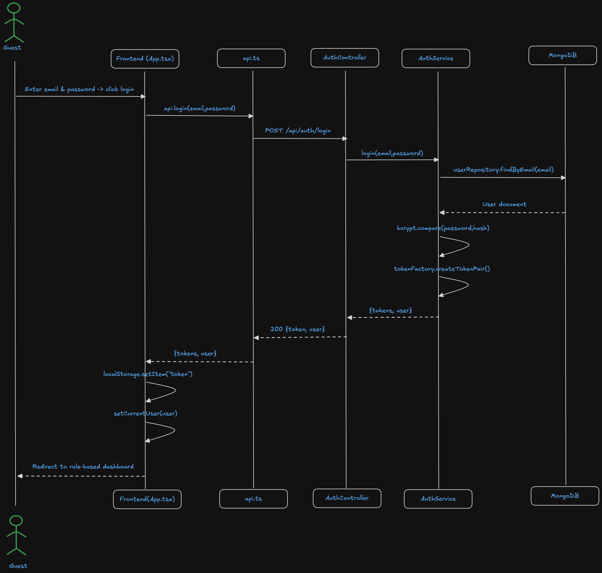
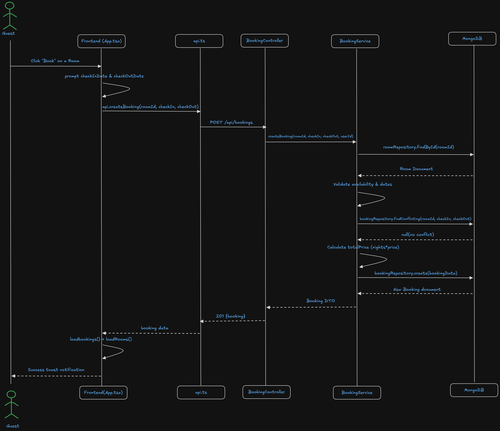
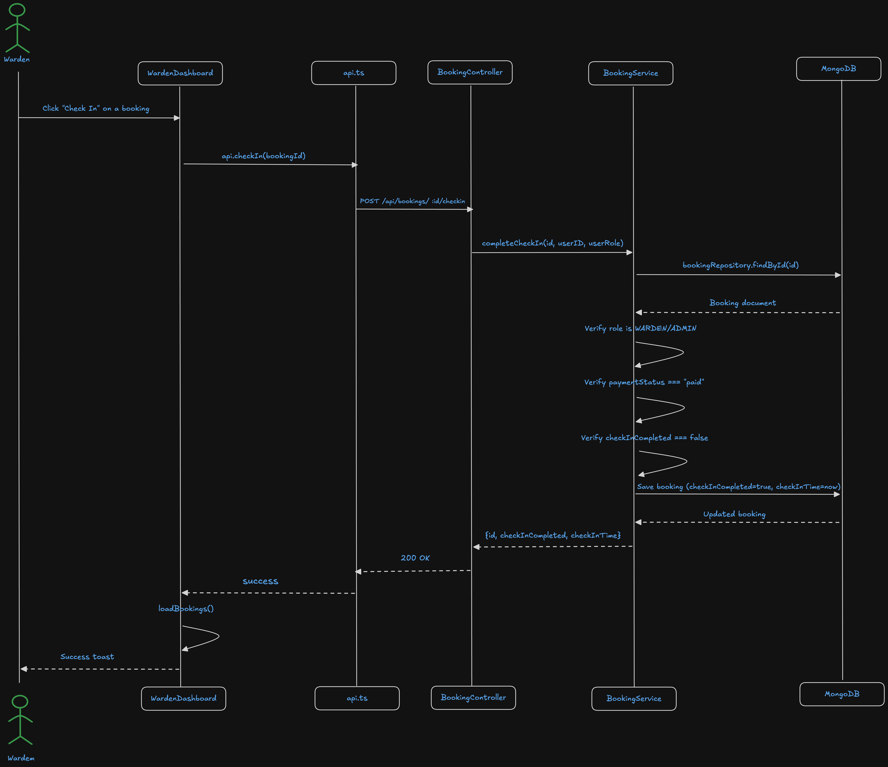
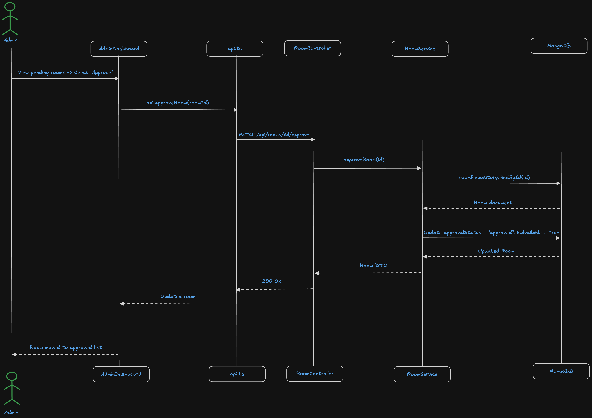

# Architecture

This document describes the technical architecture of the UniLodge platform, covering system design, component responsibilities, data flow, and deployment topology. Visual diagrams are embedded below.

---

## System Overview

UniLodge is a three-tier web application structured as an npm monorepo. A Next.js frontend communicates with an Express REST API, which reads and writes to a MongoDB database. A separate AI engine service handles recommendation and chat workloads, keeping inference latency isolated from the core API.

```
Client Browser
      |
      | HTTPS
      v
Frontend — Next.js (port 3000)
      |
      | REST / JSON
      v
Backend API — Express (port 5001)
      |
      | MongoDB driver / pg-pool
      v
Database — MongoDB + PostgreSQL

AI Engine — Express (port 3002)
      |
      | OpenRouter API (HTTPS)
      v
LLM Inference (OpenRouter / Hugging Face)
```

---

## Component Responsibilities

### Frontend (`apps/frontend`)

- Built with Next.js 14 (App Router) and TypeScript.
- Serves three role-specific portals: Student, Warden, and Admin.
- Manages client-side state and route-level authentication guards.
- Communicates with the backend exclusively through the REST API.

### Backend API (`apps/backend`)

- Express application running on port 5001.
- Handles authentication (JWT), room management, booking lifecycle, and user profiles.
- Validates all inputs and enforces role-based access control via middleware.
- Connects to MongoDB for document storage and PostgreSQL for structured analytics queries.

### AI Engine (`apps/ai-engine`)

- Lightweight Express service exposing AI endpoints to the backend.
- Uses OpenRouter to call hosted LLMs for room recommendations, price guidance, and student chat support.
- Stateless — each request is self-contained.

### Shared Package (`packages/shared`)

- TypeScript types, interfaces, and utility functions shared across `frontend`, `backend`, and `ai-engine`.
- Enforces a single source of truth for domain models (User, Room, Booking, Review).

---

## Data Flow Diagrams

### User Login Flow

Illustrates how a student authenticates, receives a JWT, and enters the platform.



---

### Room Booking Flow

End-to-end path from a student selecting a room to a confirmed booking record in the database.



---

### Booking Request Flow

Shows the internal state machine of a booking request: pending, warden review, admin approval, and final confirmation.


---

### Warden Check-In Flow

Details how a warden logs a physical check-in event against an approved booking.



---

### Admin Room Approval Flow

Covers the admin workflow for reviewing a new room listing submitted by a property provider.



---

## Class Diagram

Static structure of the core domain model, showing entities and their relationships.


---

## Entity-Relationship Diagram

Database schema relationships across Users, Rooms, Bookings, and Reviews collections.


---

## Deployment Architecture

```
GitHub Repository
      |
      |-- Frontend code  -->  Vercel (CDN-distributed)
      |-- Backend code   -->  Railway / Heroku (container)
      |-- AI Engine      -->  Cloud function or containerised service
```

Environment variables control all service URLs, so each tier can be deployed and scaled independently.

---

## Security Considerations

- All API routes (except `/health` and public listing reads) require a valid JWT.
- Tokens are short-lived; refresh logic is handled client-side.
- Environment secrets are never committed — see `.env.example` for required variables.
- CORS is configured to allow only the frontend origin in production.
