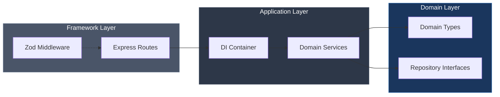
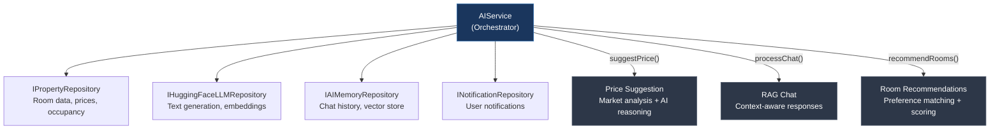

# UniLodge v2 — System Design & Architecture Report

> **Document Version:** 2.0  
> **Date:** April 2026  
> **Author:** Architecture Team  
> **Status:** Production Ready  

---

## Executive Summary

UniLodge v2 represents a ground-up architectural redesign of the campus accommodation management platform. This document provides an exhaustive technical analysis of the system's design decisions, architectural patterns, dependency management, and quality assurance strategy.

The platform serves three distinct user personas — **Guests** (visiting interns and lecturers), **Wardens** (property managers), and **Administrators** — each with tailored dashboards, permissions, and workflows.

---

## 1. Architectural Overview

### 1.1 Monorepo Strategy

UniLodge v2 uses a **workspace-based monorepo** managed by npm workspaces. This approach was chosen over alternatives (Nx, Turborepo) for its zero-configuration overhead while maintaining strict package boundaries.

```
┌─────────────────────────────────────────────────────────────┐
│                     ROOT (npm workspaces)                    │
│                                                             │
│  ┌──────────────┐  ┌──────────────┐  ┌──────────────────┐  │
│  │   Frontend    │  │   Backend    │  │   Shared Package │  │
│  │  (Next.js)    │  │  (Express)   │  │  (Zod + Types)   │  │
│  │              ◄──┤              ◄──┤                   │  │
│  │  Port: 3000   │  │  Port: 5000  │  │  Pure TypeScript  │  │
│  └──────────────┘  └──────────────┘  └──────────────────┘  │
│                                                             │
│  tsconfig.base.json ← Inherited by all workspaces           │
└─────────────────────────────────────────────────────────────┘
```

**Key decisions:**
- **Single `tsconfig.base.json`** — All workspaces extend this, enforcing `strict`, `noUnusedLocals`, `noUnusedParameters`, and `noImplicitReturns`.
- **Shared types package** — The `@unilodge/shared` package is the canonical source of truth for all data models.
- **No circular dependencies** — The dependency graph flows strictly: `Frontend → Backend → Shared` and `Frontend → Shared`.

### 1.2 Clean Architecture Implementation

The backend strictly follows **Robert C. Martin's Clean Architecture** principles:



**The Dependency Rule** — Source code dependencies only point inward. The domain layer knows nothing about Express, HTTP, or databases.

| Layer | Location | Responsibility |
|-------|----------|----------------|
| **Domain** | `src/domains/*/` | Business rules, entity types, repository interfaces |
| **Application** | `src/container.ts`, `src/services/` | Service orchestration, dependency resolution |
| **Framework** | `src/routes/`, `src/middleware/` | HTTP handling, request validation, error formatting |

---

## 2. Design Patterns — Deep Analysis

### 2.1 Dependency Injection Container

**File:** `apps/backend/src/container.ts`

The DI container implements the **Singleton** pattern with lazy initialization:

```typescript
export class Container {
    private static instance: Container;
    private aiService: AIService | null = null;

    static getInstance(): Container {
        if (!Container.instance) {
            Container.instance = new Container();
        }
        return Container.instance;
    }

    async getAIService(): Promise<AIService> {
        if (!this.aiService) {
            // Lazy initialization with all dependencies
            this.aiService = await createAIService(config, ...repos);
        }
        return this.aiService;
    }
}
```

**Why this matters:**
- Services are instantiated **once** and reused across the application lifecycle
- Dependencies are wired at the **container level**, not in individual route handlers
- Testing becomes trivial — swap the container for a mock implementation
- The AI service is **lazily initialized** because it's expensive (loads models, establishes API connections)

### 2.2 Repository Pattern

**File:** `apps/backend/src/domains/ai/repositories.ts`

The AI domain defines **four repository interfaces**:

```typescript
// Data access is abstracted behind interfaces
export interface IPropertyRepository {
    getRoomById(roomId: string): Promise<RoomMetadata | null>;
    getRooms(filters?: FilterOptions): Promise<RoomMetadata[]>;
    getOccupancyRate(roomId: string): Promise<number>;
    getNearbyPrices(roomId: string, radiusKm: number): Promise<RoomMetadata[]>;
    getPriceHistory(roomId: string, days: number): Promise<PriceHistory[]>;
}

export interface IAIMemoryRepository { ... }
export interface IHuggingFaceLLMRepository { ... }
export interface INotificationRepository { ... }
```

**The power of this approach:**
- The `AIService` depends on `IPropertyRepository`, not `PostgresPropertyRepository`
- During testing, inject `MockPropertyRepository` with predictable data
- Swapping databases (Postgres → MongoDB → DynamoDB) requires zero changes to business logic
- Each repository can be developed and tested independently

### 2.3 Façade Pattern (Frontend API Layer)

**File:** `apps/frontend/lib/services/api.ts`

The API facade provides a **unified interface** for all backend communication:

```typescript
export const api = {
    // Auth
    login: (email, password) => post('/auth/login', { email, password }),
    signup: (name, email, password) => post('/auth/register', { name, email, password }),
    getMe: () => get('/auth/me'),
    
    // Rooms
    getRooms: (params?) => get('/rooms', params),
    
    // Bookings
    getBookings: (params?) => get('/bookings', params),
    createBooking: (data) => post('/bookings', data),
    
    // AI
    sendAiChat: (message) => post('/ai/chat', { message }),
    getPriceSuggestion: (data) => post('/ai/price-suggestion', data),
    
    // ... 25+ methods
};
```

**Benefits:**
- Components never construct URLs or manage authentication tokens
- All HTTP error handling is centralized
- API versioning is transparent to consumers
- The facade acts as an **anti-corruption layer** between frontend and backend

### 2.4 SRP via Custom Hooks

**Files:** `apps/frontend/hooks/useAuth.ts`, `useRooms.ts`, `useBookings.ts`

Each hook encapsulates **exactly one concern**:

```typescript
// useAuth.ts — ONLY authentication
export const useAuth = () => {
    const [currentUser, setCurrentUser] = useState<User | null>(null);
    
    const login = async (email, password) => { ... };
    const signup = async (name, email, password) => { ... };
    const logout = () => { ... };
    const loadUserFromToken = async () => { ... };
    
    return { currentUser, login, signup, logout, loadUserFromToken };
};
```

**This ensures:**
- Page components remain **purely presentational**
- Business logic is **testable without rendering**
- Hooks can be **composed** without coupling
- State management is **co-located** with the logic that modifies it

### 2.5 Zod Schema Validation

**File:** `packages/shared/src/types.ts`

Types are **derived from Zod schemas**, ensuring compile-time and runtime validation are always in sync:

```typescript
// Define the schema ONCE
export const BookingSchema = z.object({
    id: z.string(),
    roomId: z.string(),
    userId: z.string(),
    checkInDate: z.string(),
    checkOutDate: z.string(),
    status: z.nativeEnum(BookingStatus).default(BookingStatus.PENDING),
    totalPrice: z.number().optional(),
    paymentStatus: z.nativeEnum(PaymentStatus).optional(),
    room: RoomSchema.optional(),
    user: UserSchema.optional(),
    checkInCompleted: z.boolean().optional(),
    checkOutCompleted: z.boolean().optional(),
});

// TypeScript type is INFERRED — zero drift guaranteed
export type Booking = z.infer<typeof BookingSchema>;
```

**Usage in middleware:**
```typescript
// Zod validates at the API boundary — invalid data never reaches domain logic
export const validateRequest = (schema: AnyZodObject) => {
    return async (req, res, next): Promise<void> => {
        try {
            await schema.parseAsync(req.body);
            next();
        } catch (error) {
            if (error instanceof ZodError) {
                res.status(400).json({
                    error: 'Validation failed',
                    details: error.errors.map(e => ({
                        path: e.path.join('.'),
                        message: e.message
                    }))
                });
                return;
            }
            res.status(400).json({ error: 'Invalid request data' });
        }
    };
};
```

---

## 3. AI Engine Architecture

### 3.1 Service Design

The `AIService` orchestrates four repositories to deliver three core capabilities:



### 3.2 Price Suggestion Pipeline

1. **Fetch room metadata** from PropertyRepository
2. **Gather market context** (nearby prices, 30-day price history, occupancy rate)
3. **Construct structured prompt** with all data points
4. **Call LLM** with low temperature (0.5) for deterministic pricing
5. **Parse JSON response** with fallback defaults
6. **Validate with Zod** — `PriceSuggestionSchema.parse()`
7. **Store embeddings** for future reference

### 3.3 RAG Chat Pipeline

1. **Validate input** with `ChatMessageSchema`
2. **Retrieve conversation history** (last 10 messages)
3. **Extract room context** if mentioned
4. **Generate embeddings** for similarity search
5. **Construct augmented prompt** with context + similar content
6. **Generate response** with higher temperature (0.7) for natural language
7. **Store both messages** in memory repository

---

## 4. Frontend Architecture

### 4.1 Component Hierarchy

```
App (page.tsx)
├── Header (navigation, auth state)
├── HomePage (landing, testimonials, CTA)
├── LoginPage (auth forms)
├── GuestDashboard
│   ├── RoomCard[] (room listings)
│   ├── BookingDetailsModal
│   ├── MessCard (digital QR card)
│   ├── GuestRequestModal
│   └── AiAgentChat
├── WardenDashboard
│   ├── BookingTable (check-in/out management)
│   └── AiAgentChat
├── AdminDashboard
│   ├── AnalyticsCards
│   ├── WardenManagement
│   ├── PaymentTable
│   ├── BookingRequestManager
│   ├── PriceSuggestionTool
│   └── AiAgentChat
└── MyBookingsPage
```

### 4.2 Role-Based Access Control

Permissions are enforced at both the **component level** and the **API level**:

```typescript
// lib/utils/permissions.ts
export function canCheckInOut(role: Role): boolean {
    return role === Role.ADMIN || role === Role.WARDEN;
}

export function canManageUsers(role: Role): boolean {
    return role === Role.ADMIN;
}

export function canSubmitBookingRequest(role: Role): boolean {
    return role === Role.GUEST;
}
```

---

## 5. Quality Assurance

### 5.1 TypeScript Strict Mode

The project enforces the strictest TypeScript configuration:

```json
{
    "strict": true,
    "noUnusedLocals": true,
    "noUnusedParameters": true,
    "noImplicitReturns": true,
    "noFallthroughCasesInSwitch": true
}
```

**Current Status:** ✅ **0 errors** across all workspaces (backend + frontend)

### 5.2 Testing Strategy

| Layer | Tool | Coverage |
|-------|------|----------|
| Backend Domain Logic | **Jest + ts-jest** | Auth service (3 tests passing) |
| API Route Validation | **Zod Schemas** | Runtime validation on all POST routes |
| Frontend E2E | **Cypress** | Homepage navigation + login flow |

### 5.3 Error Handling

All Express routes follow a consistent pattern:
- Return type annotations (`Promise<void>`) prevent `TS7030` errors
- Error responses use a standardized JSON format: `{ error: string, message?: string }`
- The global error handler catches unhandled exceptions with development-mode stack traces

---

## 6. Security Considerations

| Concern | Implementation |
|---------|---------------|
| **Authentication** | JWT-based Bearer tokens |
| **Input Validation** | Zod schemas at API boundaries |
| **Rate Limiting** | Custom sliding-window rate limiter middleware |
| **RBAC** | Role enum enforced at route + component level |
| **Error Exposure** | Stack traces only in `NODE_ENV=development` |
| **API Keys** | Environment variables, never committed to source |

---

## 7. Future Roadmap

1. **Database Integration** — Implement `PostgresUserRepository`, `PostgresRoomRepository` to replace in-memory mocks
2. **CI/CD Pipeline** — GitHub Actions for lint + test + build on every PR
3. **WebSocket Support** — Real-time check-in/check-out notifications
4. **Expanded Test Coverage** — Room and Booking domain service unit tests
5. **Docker Deployment** — Multi-stage Docker builds for all workspaces
6. **Monitoring** — Structured logging with correlation IDs

---

## Appendix A: Build & Verification Commands

```bash
# Verify zero TypeScript errors (backend)
cd apps/backend && npx tsc --noEmit

# Verify zero TypeScript errors (frontend)
cd apps/frontend && npx tsc --noEmit

# Run backend unit tests
cd apps/backend && npm test

# Run frontend E2E tests
cd apps/frontend && npx cypress open

# Install all dependencies
npm install
```

---

<p align="center"><em>This document is auto-generated and maintained as part of the UniLodge v2 architecture review process.</em></p>
